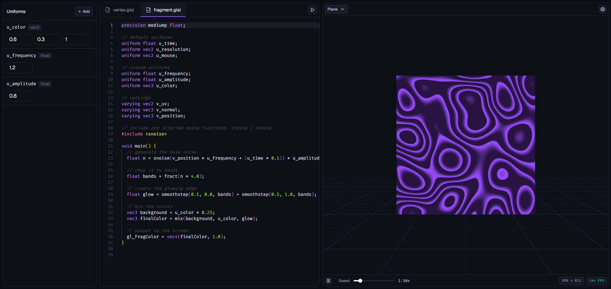

# Shader Editor ⚡️

A slick WebGL shader playground. It allows you to quickly write and test GLSL (`fragment` and `vertex` shaders) without any setup in a familiar threejs environment.



## 🚀 Tech Stack

- **Core:** React 18, TypeScript, Vite
- **WebGL:** Three.js, React Three Fiber (`@react-three/fiber`), Drei
- **State Management:** Jotai
- **Editor:** Monaco Editor
- **UI Components:** Tailwind CSS, Base UI

## 📦 Getting Started

```bash
git clone https://github.com/soumakk/shader-editor
cd shader-editor
npm install
npm run dev
```

The app will be running at http://localhost:5173.

## 🧩 Using Includes

Shader Editor comes with pre-configured glsl functions. Simply drop an include at the top of your file to use it

```glsl
#include <snoise> // Simplex Noise
#include <cnoise> // Classic Perlin Noise

void main() {
    float n = snoise(v_position + u_time);
}
```
